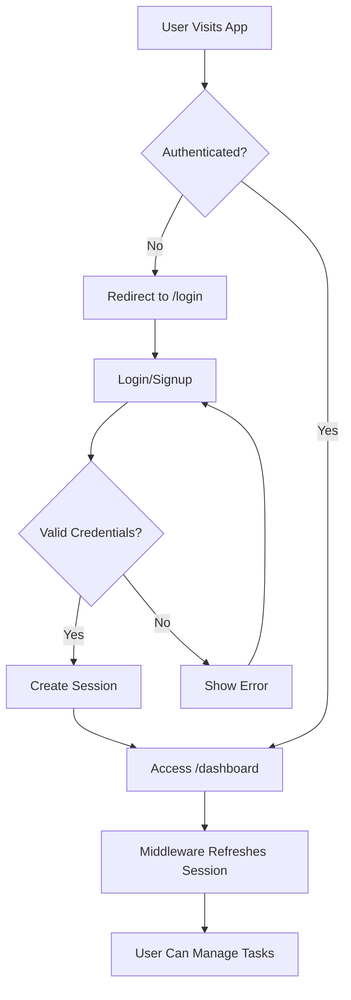

# Task Manager - Production-Ready Task Management Application

A full-stack task management web application built with Next.js, TypeScript, Tailwind CSS, and Supabase, featuring secure authentication, CRUD operations, filtering, sorting, and complete data isolation using Row Level Security.

## Tech Stack

- **Frontend Framework**: Next.js 15 (App Router)
- **Language**: TypeScript
- **Styling**: Tailwind CSS
- **Backend/Database**: Supabase
  - Authentication: Supabase Auth
  - Database: PostgreSQL
- **Deployment**: Vercel

## Features

### Authentication
- Email and password signup
- Email and password login
- Secure logout
- Session persistence across page refreshes
- Protected routes with automatic redirects
- Server-side session validation

### Task Management
- **Create**: Add new tasks with title, description, due date, and status
- **Read**: View all your tasks with filtering and sorting
- **Update**: Edit task details inline
- **Delete**: Remove tasks with confirmation

### Filtering & Sorting
- **Filter by Status**: All, To Do, In Progress, Done
- **Sort by Due Date**: Ascending (earliest first) or Descending (latest first)
- **Server-Side Processing**: All filtering and sorting happens in Supabase queries for optimal performance

### Security
- **Row Level Security (RLS)**: Complete data isolation between users
- **Authentication Required**: All task operations require valid authentication
- **User-Scoped Queries**: Every database query automatically filters by `user_id`

## Authentication Flow



### How It Works

1. **Middleware Protection**: Every request goes through middleware that checks authentication status
2. **Session Refresh**: Middleware automatically refreshes the session to keep users logged in
3. **Route Guards**: 
   - Unauthenticated users accessing `/dashboard` → redirected to `/login`
   - Authenticated users accessing `/login` or `/signup` → redirected to `/dashboard`
4. **Server-Side Validation**: All server actions verify user authentication before processing

## Database Structure

### Tasks Table Schema

```sql
CREATE TABLE tasks (
  id UUID PRIMARY KEY DEFAULT gen_random_uuid(),
  user_id UUID NOT NULL REFERENCES auth.users(id) ON DELETE CASCADE,
  title TEXT NOT NULL,
  description TEXT,
  due_date DATE NOT NULL,
  status TEXT NOT NULL CHECK (status IN ('todo', 'in_progress', 'done')),
  created_at TIMESTAMP WITH TIME ZONE DEFAULT NOW()
);
```

### How Tasks Are Linked to Users

- Each task has a `user_id` column that references `auth.users(id)`
- When creating a task, the server action automatically sets `user_id = auth.uid()`
- All queries include `.eq('user_id', user.id)` to ensure users only see their own data
- Foreign key constraint with `ON DELETE CASCADE` ensures tasks are deleted when a user is deleted

### Row Level Security (RLS)

RLS is a PostgreSQL feature that enforces access control at the database level, not just the application level.

#### Why RLS Matters

1. **Defense in Depth**: Even if application code has bugs, the database enforces security
2. **Zero Trust**: No query can bypass security policies
3. **Automatic Enforcement**: Developers can't accidentally forget to filter by user_id
4. **API Security**: Direct database access (via Supabase client) is still secure

#### RLS Policies

```sql
-- Enable RLS on the tasks table
ALTER TABLE tasks ENABLE ROW LEVEL SECURITY;

-- INSERT: Users can only create tasks for themselves
CREATE POLICY "Users can insert their own tasks"
ON tasks FOR INSERT TO authenticated
WITH CHECK (auth.uid() = user_id);

-- SELECT: Users can only view their own tasks
CREATE POLICY "Users can view their own tasks"
ON tasks FOR SELECT TO authenticated
USING (auth.uid() = user_id);

-- UPDATE: Users can only update their own tasks
CREATE POLICY "Users can update their own tasks"
ON tasks FOR UPDATE TO authenticated
USING (auth.uid() = user_id)
WITH CHECK (auth.uid() = user_id);

-- DELETE: Users can only delete their own tasks
CREATE POLICY "Users can delete their own tasks"
ON tasks FOR DELETE TO authenticated
USING (auth.uid() = user_id);
```

#### How RLS Works

- `auth.uid()` returns the ID of the currently authenticated user
- `USING` clause: Determines which rows are visible for SELECT, UPDATE, DELETE
- `WITH CHECK` clause: Validates data being inserted or updated
- If a policy check fails, the operation is denied at the database level

### Performance Indexes

```sql
CREATE INDEX idx_tasks_user_id ON tasks(user_id);
CREATE INDEX idx_tasks_due_date ON tasks(due_date);
CREATE INDEX idx_tasks_status ON tasks(status);
CREATE INDEX idx_tasks_created_at ON tasks(created_at);
```

These indexes optimize:
- User-specific queries (user_id)
- Sorting by due date (due_date)
- Filtering by status (status)
- Default ordering (created_at)

## Filter & Sort Logic

### Server-Side Implementation

All filtering and sorting happens in Supabase queries, not client-side JavaScript:

```typescript
let query = supabase
  .from("tasks")
  .select("*")
  .eq("user_id", user.id);

// Apply status filter
if (filterStatus && filterStatus !== "all") {
  query = query.eq("status", filterStatus);
}

// Apply sorting
if (sortOrder) {
  query = query.order("due_date", { ascending: sortOrder === "asc" });
}
```

### Why Server-Side?

1. **Performance**: Database engines are optimized for filtering and sorting
2. **Scalability**: Works efficiently with thousands of tasks
3. **Consistency**: Single source of truth
4. **Future-Proof**: Easy to add pagination later

### URL-Based State

- Filter and sort preferences are stored in URL query parameters
- Example: `/dashboard?filter=todo&sort=asc`
- Benefits:
  - Shareable URLs
  - Browser back/forward works correctly
  - No client-side state management needed

## Setup Instructions

### Prerequisites

- Node.js 18+ installed
- A Supabase account (free tier works)
- Git (optional, for version control)

### 1. Clone or Download the Project

```bash
cd d:\Task-Management-App
```

### 2. Install Dependencies

```bash
npm install
```

### 3. Set Up Supabase

1. Go to [supabase.com](https://supabase.com) and create a new project
2. Wait for the database to be provisioned (takes ~2 minutes)
3. Go to **SQL Editor** in the Supabase dashboard
4. Copy the contents of `supabase-schema.sql` and run it
5. Verify the `tasks` table was created under **Table Editor**

### 4. Configure Environment Variables

1. Copy `.env.local.example` to `.env.local`:
   ```bash
   cp .env.local.example .env.local
   ```

2. Get your Supabase credentials:
   - Go to **Project Settings** → **API**
   - Copy the **Project URL** and **anon public** key

3. Update `.env.local`:
   ```
   NEXT_PUBLIC_SUPABASE_URL=https://your-project.supabase.co
   NEXT_PUBLIC_SUPABASE_ANON_KEY=your-anon-key
   ```

### 5. Run the Development Server

```bash
npm run dev
```

Open [http://localhost:3000](http://localhost:3000) in your browser.

### 6. Test the Application

1. Click "Sign up" and create an account
2. You'll be automatically logged in and redirected to the dashboard
3. Create a few tasks
4. Test filtering and sorting
5. Edit and delete tasks 
6. Log out and log back in to verify session persistence

### 7. Build for Production 

```bash
npm run build
npm run start
```

## Project Structure

```
task-manager-supabase/
├── app/
│   ├── dashboard/
│   │   ├── actions.ts          # Server actions for CRUD
│   │   └── page.tsx            # Dashboard page
│   ├── login/
│   │   └── page.tsx            # Login page
│   ├── signup/
│   │   └── page.tsx            # Signup page
│   ├── globals.css             # Global styles
│   ├── layout.tsx              # Root layout
│   └── page.tsx                # Home page (redirects to login)
├── components/
│   ├── FilterSort.tsx          # Filter and sort controls
│   ├── TaskCard.tsx            # Individual task card
│   ├── TaskForm.tsx            # Task creation form
│   └── TaskList.tsx            # Task list container
├── lib/
│   └── supabase/
│       ├── client.ts           # Browser Supabase client
│       ├── middleware.ts       # Middleware helper
│       └── server.ts           # Server Supabase client
├── types/
│   └── task.ts                 # TypeScript types
├── middleware.ts               # Route protection
├── supabase-schema.sql         # Database schema
├── .env.local.example          # Environment template
├── package.json
├── tsconfig.json
├── tailwind.config.ts
└── next.config.ts
```

## Assumptions Made

1. **Email Confirmation**: Supabase email confirmation is disabled for development. In production, you should enable it in Supabase Auth settings.

2. **Password Requirements**: Using Supabase default password requirements (minimum 6 characters). Can be customized in Supabase Auth settings.

3. **No Pagination**: Current implementation loads all tasks. For production with 1000+ tasks per user, implement pagination.

4. **No Real-time Updates**: Tasks update on page refresh or after mutations. Supabase Realtime can be added for live updates.

5. **Single User Sessions**: One session per user. Supabase supports multiple sessions if needed.

6. **Error Handling**: Errors are displayed to users. In production, consider logging errors to a service like Sentry.

7. **No Task Sharing**: Tasks are private to each user. Sharing would require additional tables and RLS policies.


## Future Enhancements for Scale

For 10,000+ users, consider:

1. **Database Indexes**: Already implemented on user_id, due_date, status
2. **Pagination**: Implement cursor-based pagination for task lists
3. **Query Optimization**: Use Supabase query builder efficiently (already done)
4. **Caching**: Add Redis for frequently accessed data
5. **CDN**: Serve static assets via CDN (Vercel does this automatically)
6. **Database Connection Pooling**: Supabase handles this automatically
7. **Rate Limiting**: Implement rate limiting on API routes
8. **Monitoring**: Add application performance monitoring (APM)
9. **Search**: Add full-text search for task titles and descriptions
10. **Analytics**: Track user behavior and performance metrics

## License

This project is created as a hiring assignment demonstration.
